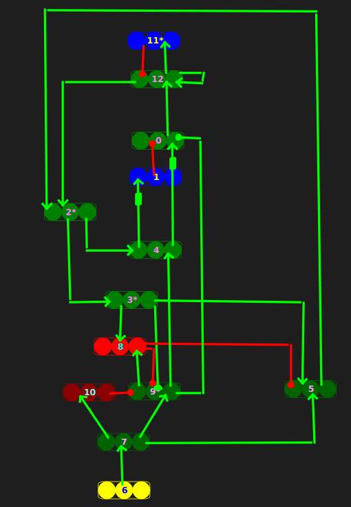
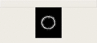

# NeuronLayerBox <br>
Computational Neuroscience platform with cuda.<br>
This platform is mainly for calculating stephen grossberg's model.<br>
<br>
## 1.How to run:<br>
In NeuronLayerBox file to recompile:<br>
```
make clean
make
./NLB
```
open anthor terminal:python main.py,you will see this:<br>
this picture show the fmri of layer5 in SMART model<br>
<br>
<br>
Note:"./NLB" must be first.if there are some issues,you will clean the shared memory or restart your os. <br>

## 2.how to use it:<br>
you can refer main.py<br>
your python file must live in NeuronLayerBOx1.0 file.<br>

### 2.1 init<br>
```
import numpy as np
import sys
sys.path.append("Interface/python/")
from init import NeuronLayerBox
NLB=NeuronLayerBox(step_ms=1,model=1,spike=0,restore=1)
```
model=1:like gym,u can control step time,model=0:real time,u can't control step time,but u can get the output anytime.<br>
spike=0:output fmri data,spike=1:output spike data that indlude the last ten bits of data.<br>
restore=1:restore last trained model,restore=0:train a new model without pertrained model.<br>

### 2.2 process<br>
```
input_src=[]
input_src.append(some input 2-D array) #the num of array must equal input num.In simple terms,len(input_src)=input_num
NLB.input(input_src)                   #input must be list
for i in range(50):
  NLB.step(5)                          #process 5ms if model=1.if model=0,this will return immediately.
```
### 2.3 save model<br>
```
NLB.save()
```
it will save model in load_data/SaveData. NLB terminal will print information about model's name.<br>

### 2.4 exit<br>
```
NLB.exit()
```
this will delete shared memory and release NLB.<br>
